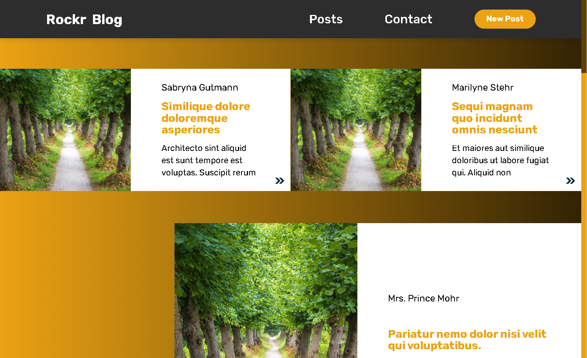

<h1 align="center">Infinite Scroll blog</h1>

<h1 align="center"></h1>

## ✨ Technologies

This project was developed using the following technologies:

- [React](https://reactjs.org/)
- [React DOM](https://pt-br.reactjs.org/docs/react-dom.html)
- [CREATE-REACT-APP](https://github.com/facebook/create-react-app)
- [TypeScript](https://www.typescriptlang.org/)
- [Styled-components](https://www.styled-components.com/)
- [Axios](https://axios-http.com/docs/intro)
- [ESLint](https://eslint.org/)
- [EditorConfig](https://editorconfig.org/)

## 💻 Project

### Preview the project [here](https://infinite-scroll-blog-jet.vercel.app/)

React application with infinite scroll, you can checkout the articles on the infinite scroll and at the "New Post" page create them, when an error occur while creating new posts, a message will be displayed at the screen alerting the user, you can also click on the arrow from each article and checkout the article's full information.

## 🔧 Technologies choice

Project developed using the React library to make it a Single Page Application, which guarantees the best performance when running directly in the client's browser, Create React Application tool to configure the environment, TypeScript as the language to guarantee props and state values accordingly as expected from the contract, Axios to fetch data from the API, Styled Components to avoid unnecessary and conflicting component styles, Atomic Design as the design pattern to promote clean maintenance and good coding practices according to ESLint and EditorConfig.

 ## 🔨 Project Architecture

 Project Architecture based on Atomic Design.

 ```
 src
 ├──assets
 │   ├──images
 │   └──styles
 ├──components
 │   ├──atom
 │   ├──molecule
 │   └──organism
 ├──helpers
 │   ├──ensurers
 │   └──hooks
 ├──pages
 ├──routes
 ├──screenshots
 └──services
 ```

 ## 🧪 Components

 ```
 Component
  ├──Component.tsx
  ├──styles.ts
  └──index.ts
 ```

## 🚀 How to run

Clone this repository.
```bash
# Run to install dependencies.
$ yarn

# Run to start the project on `localhost:3000`.
$ yarn start
```

## 🚧 How to build

Clone this repository.
```bash
# Run to install dependencies.
$ yarn

# Run to start building the project.
$ yarn build

# Builded project it´s now available at folder `root/build`
```
